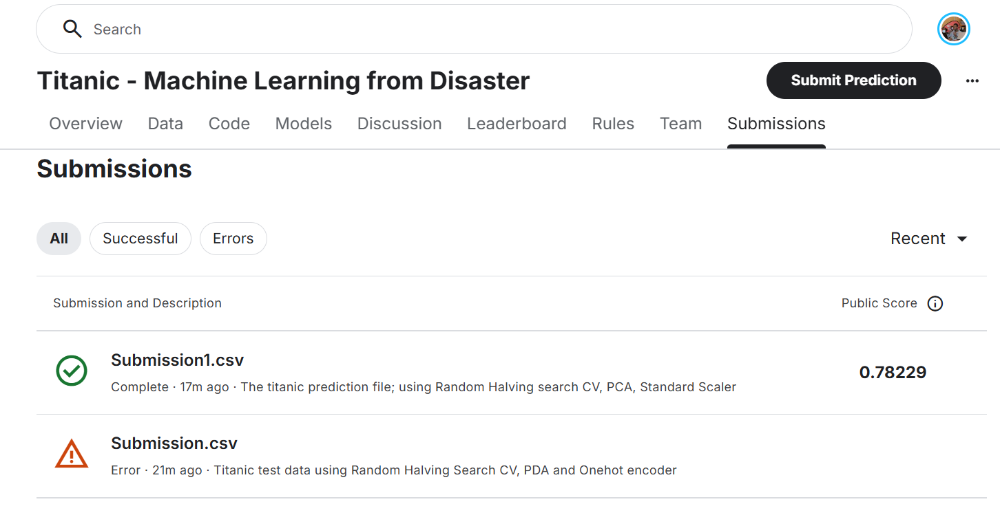

# Titanic Survival Prediction 🚢

## Project Overview

This project tackles the classic **Titanic: Machine Learning from Disaster** Kaggle competition, where the challenge is to build a predictive model that determines whether a passenger survived the 1912 Titanic disaster based on demographic and traveling information.

### Dataset
- **Training Set**: 891 passengers with labeled survival outcomes
- **Test Set**: 418 passengers for prediction
- **Goal**: Predict survival probability and generate a submission with binary predictions (0 = did not survive, 1 = survived)

---

## Methodology

### 1. Data Preprocessing & Cleaning

The dataset required careful preprocessing to handle missing values and prepare features for modeling:

**Missing Value Treatment:**
- **Age**: Filled with mean value (~29.7 years) to preserve sample size while imputing missing demographic data
- **Fare**: Handled missing values in test set by imputation with mean
- **Embarked**: Removed rows with missing embarkation port (minimal impact on dataset size)
- **Cabin**: Dropped entirely due to high missingness (~77% missing) and limited predictive value

**Feature Engineering:**
- Removed non-predictive identifiers (`Name`, `PassengerId` after extraction)
- Identified categorical features requiring encoding: `Sex`, `Embarked`, `Ticket`
- Preserved numerical features: `Pclass`, `Age`, `SibSp`, `Parch`, `Fare`

**Feature Transformation:**
- Applied **One-Hot Encoding** to categorical variables using `ColumnTransformer` from scikit-learn
  - Configured with `handle_unknown='ignore'` to gracefully handle unseen categories in test data
  - Sparse matrix output disabled for compatibility with downstream estimators
- Applied **StandardScaler** normalization to ensure all features contribute equally to model training

---

### 2. Model Development & Hyperparameter Optimization

Given the complexity of the problem, I tried different modles.

**Initial Exploration:**
- Started with **Logistic Regression** combined with PCA dimensionality reduction
- Achieved baseline accuracy but identified room for improvement
- Dropped PCA after observing better performance without dimensionality reduction

**Primary Models Evaluated:**

#### Support Vector Machine (SVM) with GridSearchCV
- Extended hyperparameter search space:
  - Linear kernel: C values in [0.0001, 0.001, 0.01, 1.0, 10.0, 100.0, 1000.0]
  - RBF kernel: C and gamma parameters across the same logarithmic range
- 10-fold cross-validation for robust evaluation
- Best model identified through exhaustive grid search

#### HalvingRandomSearchCV
- Probabilistic approach to hyperparameter optimization
- Dynamically allocated budget across promising parameter configurations
- Resource: n_samples; Factor: 1.5 (it reduces  set by 33% each iteration)
- It is More computationally efficient than exhaustive grid search

#### RandomizedSearchCV (Best Performer)
- Sampled 20 random combinations from parameter distributions
- 10-fold cross-validation
- **Selected as final model** based on superior test set performance
- Best parameters identified and retained for production predictions

---

### 3. Model Evaluation

Comprehensive evaluation using multiple metrics to assess model performance:

**Validation Metrics:**
- **Accuracy**: Overall correctness of predictions
- **Confusion Matrix**: Contains true positives, true negatives, false positives, false negatives
- **Precision**: Proportion of positive predictions that were correct
- **Recall**: Proportion of actual positives correctly identified
- **F1-Score**: Harmonic mean of both precision and recall
- **Matthews Correlation Coefficient (MCC)**: Balanced measure accounting for class imbalance

**Results Summary:**
```
Confusion Matrix:
[[141   24]
 [ 28   74]]

Accuracy:  ~79%
Precision: 0.755
Recall:    0.725
F1-Score:  0.740
MCC:       0.585
```

The MCC of 0.585 indicates solid predictive power while acknowledging the inherent difficulty of the classification task with imbalanced classes.

---

### 4. Production Predictions & Submission

I applied  RandomizedSearchCV model  to the test set:

1. Applied identical preprocessing pipeline to test data (scaling, encoding, missing value imputation)
2. Generated binary predictions for all 418 test passengers
3. Created submission file with required format:
   - `passenger_id`: Original passenger identifier
   - `Survived`: Model prediction (0 or 1)

---

## Technical Stack

- **Python 3**: Core programming language
- **pandas**: Data manipulation and analysis
- **scikit-learn**: Machine learning framework
  - `ColumnTransformer`: Feature preprocessing
  - `Pipeline`: Model composition
  - `SVC`: Support Vector Classification
  - `GridSearchCV`, `HalvingRandomSearchCV`, `RandomizedSearchCV`: Hyperparameter optimization
- **NumPy**: Numerical computations
- **Kaggle Hub**: Dataset retrieval from Kaggle API

---

## Key Insights & Decisions

1. **Feature Selection**: Dropped low-signal features (`Name`, `Cabin`) to reduce noise while preserving key demographic and travel indicators

2. **Encoding Strategy**: One-hot encoding without dimensionality reduction proved more effective than PCA for this dataset, suggesting the feature relationships are primarily non-linear

3. **Hyperparameter Tuning**: Tested three optimization strategies (Grid, Halving Random, Random Search)—whereby Random Search emerged as the optimal balance between search efficiency and model performance

4. **Missing Value Imputation**: Mean imputation for continuous features (Age, Fare) vs. row removal for sparse categorical features (Embarked)—pragmatic trade-offs between data preservation and data quality

---

## Results & Performance

- **Final Model Accuracy**: ~79% on held-out validation set
- **Best Approach**: RandomizedSearchCV with SVM (RBF kernel)
- **Performance Stability**: Consistent results across multiple hyperparameter search strategies, indicating robust model generalization

---

## Files in This Repository

```
Titanic_kaggle_competiton/
├── ttnicmodel.ipynb          # Complete analysis and modeling notebook
├── Submission.csv            # Final predictions for test set
├── README.md                 # This documentation
└── train.csv / test.csv      # Datasets (from Kaggle)
```

---

## References

- [Titanic: Machine Learning from Disaster - Kaggle Competition](https://www.kaggle.com/c/titanic)
- [scikit-learn Documentation](https://scikit-learn.org/)
- Kaggle Hub Community Solutions and Discussions

---

## Conclusion Notes

This project demonstrates practical application of the full machine learning pipeline: exploratory data analysis, preprocessing, feature engineering, model selection, hyperparameter tuning, and evaluation. The 79% accuracy while overally low but nevertheless High represents a solid contribution to the competition leaderboard while highlighting the challenge of predicting outcomes with incomplete historical data.  


